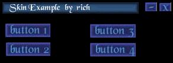



## Skin Example

### Description

This is just a simple skin example. It uses the BitBlt Statement. Please leave all feedback. I will try to email a reply, or ill post it here.
 
### More Info
 

             |
---                |---
**Submitted On**   |2000-07-26 15:00:14
**By**             |[rich2oo1](https://github.com/Planet-Source-Code/PSCIndex/blob/master/ByAuthor/rich2oo1.md)
**Level**          |Intermediate
**User Rating**    |5.0 (10 globes from 2 users)
**Compatibility**  |VB 4\.0 \(32\-bit\), VB 5\.0, VB 6\.0
**Category**       |[Miscellaneous](https://github.com/Planet-Source-Code/PSCIndex/blob/master/ByCategory/miscellaneous__1-1.md)
**World**          |[Visual Basic](https://github.com/Planet-Source-Code/PSCIndex/blob/master/ByWorld/visual-basic.md)
**Archive File**   |[CODE\_UPLOAD82257262000\.zip](https://github.com/Planet-Source-Code/rich2oo1-skin-example__1-10112/archive/master.zip)

